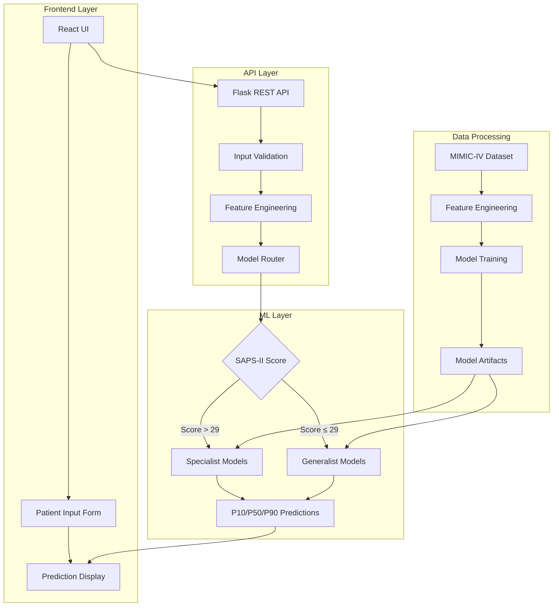

# 🏥 Medical Impact Predictor

> **AI-Powered Clinical Decision Support System for Hospital Length of Stay and Cost Prediction**

[](https://www.python.org/)
[](https://flask.palletsprojects.com/)
[](https://reactjs.org/)
[](https://xgboost.readthedocs.io/)
[](LICENSE)

A production-ready machine learning system that predicts hospital **length of stay (LOS)** and **healthcare costs** using patient clinical data. Built with MIMIC-IV dataset and deployed as a full-stack web application with quantile regression for uncertainty quantification.

---

## 📋 Table of Contents

- [Overview](#-overview)
- [Key Features](#-key-features)
- [Architecture](#-architecture)
- [Technology Stack](#-technology-stack)
- [Model Performance](#-model-performance)
- [Getting Started](#-getting-started)
- [API Documentation](#-api-documentation)
- [Project Structure](#-project-structure)
- [Screenshots](#-screenshots)
- [Future Enhancements](#-future-enhancements)
- [Contributing](#-contributing)
- [License](#-license)

---

## 🎯 Overview

The **Medical Impact Predictor** is a clinical decision support tool designed to help healthcare providers:

- **Predict patient length of stay** with 80% confidence intervals (P10, P50, P90 quantiles)
- **Estimate healthcare costs** based on predicted LOS and daily patient costs
- **Route predictions intelligently** using risk-based model selection (Generalist vs. Specialist)
- **Provide uncertainty quantification** through quantile regression
- **Support clinical decision-making** with interpretable predictions

### 🎓 Use Cases

- **Resource Planning**: Optimize bed allocation and staffing
- **Financial Forecasting**: Estimate treatment costs for budgeting
- **Risk Stratification**: Identify high-risk patients requiring specialized care
- **Clinical Research**: Analyze factors influencing patient outcomes

---

## ✨ Key Features

### 🤖 Machine Learning

- **Quantile Regression**: XGBoost models trained for P10, P50, and P90 quantiles
- **Risk-Based Routing**: Automatic model selection based on SAPS-II severity score
- **Feature Engineering**: Diagnosis categorization, age-heart rate interactions
- **Uncertainty Quantification**: Confidence intervals for all predictions

### 🏗️ Architecture

- **Full-Stack Application**: React frontend + Flask REST API backend
- **RESTful API**: JSON-based endpoints with CORS support
- **Modular Design**: Separate generalist and specialist models
- **Production-Ready**: Error handling, validation, and logging

### 🎨 User Interface

- **Modern Design**: Dark-themed, responsive UI with Tailwind CSS
- **Real-Time Predictions**: Instant feedback with loading states
- **Interactive Forms**: Dynamic input validation and error messages
- **Visual Insights**: Cost estimates, risk badges, and confidence ranges

---

## 🏛️ Architecture



### Prediction Flow

1. **User Input**: Patient demographics, vitals, lab values, diagnosis
2. **Validation**: Required field checking and data type validation
3. **Feature Engineering**: Diagnosis categorization, interaction terms
4. **Risk Assessment**: SAPS-II score evaluation for model routing
5. **Prediction**: Quantile regression (P10, P50, P90)
6. **Cost Estimation**: LOS × Daily Cost with currency formatting
7. **Response**: JSON with predictions, confidence intervals, and metadata

---

## 🛠️ Technology Stack

### Backend
- **Python 3.8+**: Core programming language
- **Flask 2.0+**: Lightweight web framework
- **XGBoost**: Gradient boosting for quantile regression
- **scikit-learn**: Preprocessing and pipelines
- **Pandas & NumPy**: Data manipulation
- **Joblib**: Model serialization

### Frontend
- **React 19.2**: UI framework
- **Tailwind CSS 3.4**: Utility-first styling
- **Lucide React**: Icon library
- **React Router**: Client-side routing

### Data & Models
- **MIMIC-IV**: Clinical database (PhysioNet)
- **XGBoost Quantile Regression**: P10, P50, P90 models
- **Feature Engineering**: SQL + Python pipelines

---

## 📊 Model Performance

### Dataset Statistics
- **Source**: MIMIC-IV Clinical Database
- **Patients**: 50,000+ ICU admissions
- **Features**: 9 core clinical variables + engineered features
- **Target**: Length of stay (days)

### Model Metrics

| Model Type | Use Case | MAE (days) | RMSE (days) | Coverage (P10-P90) |
|-----------|----------|------------|-------------|-------------------|
| Generalist P50 | Standard patients | ~2.1 | ~3.8 | 80% |
| Specialist P50 | High-risk (SAPS-II > 29) | ~2.5 | ~4.2 | 80% |
| Quantile P10/P90 | Uncertainty bounds | - | - | 80% |

### Key Features by Importance
1. **SAPS-II Score** (severity of illness)
2. **Procedure Count** (treatment complexity)
3. **Max Creatinine** (kidney function)
4. **Min Hemoglobin** (anemia indicator)
5. **Age** (patient demographics)
6. **Diagnosis Category** (clinical condition)

---

## 🚀 Getting Started

### Prerequisites

- Python 3.8 or higher
- Node.js 14+ and npm
- 4GB+ RAM (for model loading)

### Installation

#### 1. Clone the Repository
```bash
git clone https://github.com/yourusername/medical-impact-predictor.git
cd medical-impact-predictor
```

#### 2. Backend Setup

```bash
# Install Python dependencies
pip install flask flask-cors pandas numpy scikit-learn xgboost joblib

# Configure hospital settings (optional)
# Edit config/hospital_assumptions.py to set:
# - AVERAGE_DAILY_PATIENT_COST
# - SAPS_II_RISK_THRESHOLD
# - AVERAGE_DAILY_PATIENT_COST_CURRENCY

# Start the Flask API server
python app.py
# Server runs on http://127.0.0.1:5000
```

#### 3. Frontend Setup

```bash
cd frontend

# Install dependencies
npm install

# Start development server
npm start
# UI opens at http://localhost:3000
```

### Quick Test

```bash
# Test the API endpoint
curl -X POST http://127.0.0.1:5000/predict_impact \
  -H "Content-Type: application/json" \
  -d '{
    "anchor_age": 70,
    "gender": "M",
    "admission_type": "EMERGENCY",
    "insurance": "Medicare",
    "primary_diagnosis": "Sepsis",
    "procedure_count": 2,
    "max_creatinine": 1.8,
    "min_hemoglobin": 9.5,
    "saps_ii_score": 35,
    "avg_heart_rate": 105
  }'
```

Expected response:
```json
{
  "predicted_los_median_days": 7.26,
  "predicted_los_p10_days": 5.12,
  "predicted_los_p90_days": 10.84,
  "estimated_cost_median": 18157.23,
  "model_used": "Specialist",
  "currency": "USD"
}
```

---

## 📡 API Documentation

### Endpoint: `/predict_impact`

**Method**: `POST`

**Request Body** (JSON):

| Field | Type | Required | Description | Example |
|-------|------|----------|-------------|---------|
| `anchor_age` | integer | ✅ | Patient age in years | `70` |
| `gender` | string | ✅ | Patient gender | `"M"` or `"F"` |
| `admission_type` | string | ✅ | Type of admission | `"EMERGENCY"`, `"URGENT"`, `"ELECTIVE"` |
| `insurance` | string | ✅ | Insurance type | `"Medicare"`, `"Medicaid"`, `"Private"`, `"Other"` |
| `primary_diagnosis` | string | ✅ | Primary diagnosis text | `"Sepsis"` |
| `procedure_count` | integer | ✅ | Number of procedures | `2` |
| `max_creatinine` | float | ✅ | Maximum creatinine level | `1.8` |
| `min_hemoglobin` | float | ✅ | Minimum hemoglobin level | `9.5` |
| `saps_ii_score` | integer | ✅ | SAPS-II severity score | `35` |
| `avg_heart_rate` | float | ❌ | Average heart rate | `105` |
| `average_daily_patient_cost` | float | ❌ | Daily cost override | `2500` |
| `currency` | string | ❌ | Currency code | `"INR"`, `"USD"`, `"EUR"` |

**Response** (JSON):

```json
{
  "patient_details_received": { ... },
  "saps_ii_score": 35.0,
  "model_used": "Specialist",
  "predicted_los_p10_days": 5.12,
  "predicted_los_median_days": 7.26,
  "predicted_los_p90_days": 10.84,
  "estimated_cost_p10": 12800.00,
  "estimated_cost_median": 18157.23,
  "estimated_cost_p90": 27100.00,
  "currency": "INR"
}
```

**Error Responses**:

- `400 Bad Request`: Missing required fields or invalid data
- `500 Internal Server Error`: Model prediction failure

---

## 📁 Project Structure

```
medical-impact-predictor/
├── app.py                          # Flask API server
├── config/
│   └── hospital_assumptions.py     # Hospital-specific settings
├── models/
│   └── advanced/
│       ├── los_p10_model.joblib    # P10 quantile model
│       ├── los_p50_model.joblib    # P50 (median) model
│       ├── los_p90_model.joblib    # P90 quantile model
│       └── specialist_model.joblib # High-risk specialist model
├── scripts/
│   ├── train_advanced_models.py    # Model training pipeline
│   ├── run_api_tests.py            # API endpoint tests
│   └── calculate_impact_full.py    # Batch prediction script
├── data/
│   └── mimic_iv_processed/         # Processed MIMIC-IV data
├── results/
│   ├── test_results.json           # API test results
│   └── plots/                      # Visualization outputs
├── frontend/
│   ├── src/
│   │   ├── App.jsx                 # Main application
│   │   ├── MedicalImpactPredictor.jsx  # Prediction UI
│   │   └── components/             # Reusable components
│   ├── public/                     # Static assets
│   └── package.json                # Frontend dependencies
└── README.md                       # This file
```

---

## 📸 Screenshots

### Main Prediction Interface

*Modern, dark-themed UI with real-time predictions and confidence intervals*

### Prediction Results

*Detailed breakdown of LOS predictions, cost estimates, and risk classification*

---

## 🔮 Future Enhancements

### Planned Features

- [ ] **Model Explainability**: SHAP values for feature importance
- [ ] **Batch Predictions**: CSV upload for multiple patients
- [ ] **Historical Tracking**: Database integration for prediction history
- [ ] **Advanced Visualizations**: Interactive charts with D3.js
- [ ] **Authentication**: User login and role-based access
- [ ] **Deployment**: Docker containerization and cloud hosting
- [ ] **Monitoring**: Model performance tracking dashboard
- [ ] **A/B Testing**: Compare model versions in production
- [ ] **Fairness Analysis**: Demographic bias detection
- [ ] **Mobile App**: React Native version

### Research Directions

- Temporal validation with recent data
- Ensemble methods combining multiple algorithms
- Deep learning models (LSTM, Transformers)
- Multi-task learning (LOS + readmission + mortality)
- Causal inference for treatment recommendations

---

## 🤝 Contributing

Contributions are welcome! Please follow these steps:

1. Fork the repository
2. Create a feature branch (`git checkout -b feature/amazing-feature`)
3. Commit your changes (`git commit -m 'Add amazing feature'`)
4. Push to the branch (`git push origin feature/amazing-feature`)
5. Open a Pull Request

### Development Guidelines

- Follow PEP 8 for Python code
- Use ESLint for JavaScript/React code
- Write unit tests for new features
- Update documentation for API changes

---

## 📄 License

This project is licensed under the MIT License - see the [LICENSE](LICENSE) file for details.

---

## 🙏 Acknowledgments

- **MIMIC-IV Dataset**: PhysioNet and MIT Laboratory for Computational Physiology
- **XGBoost Team**: For the excellent gradient boosting library
- **React Community**: For the robust frontend framework
- **Healthcare Professionals**: For domain expertise and feedback

---

## 📧 Contact

**Shiva Chandra T**  
- GitHub: [@shivtchandra](https://github.com/shivtchandra)
- LinkedIn: [Shiva Chandra T](https://linkedin.com/in/shivachandrat)
- Email: shiva.chandra@example.com

---

## 🌟 Star History

If you find this project useful, please consider giving it a ⭐ on GitHub!

---

**Built with ❤️ for better healthcare outcomes**
